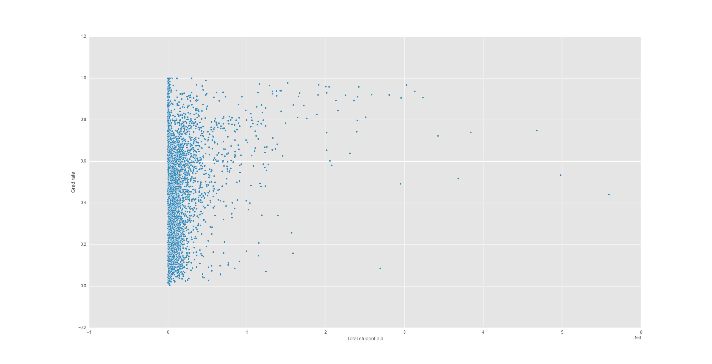

# Machine Learning Engineer Nanodegree
## Capstone Proposal
Panashe M. Fundira  
November 11th, 2016

### Domain Background
Public policy is a discipline that sits at the intersection of political science
and economics. There is no consensus among political scientists on the
definition of public policy [@cochran_american_2010]. Definitions include "a set
of actions by the government that includes, but is not limited to, making laws
and is defined in terms of a common goal or purpose" [@cochran_american_2010],
or the more nebulous
"what governments do and neglect to do" [@moran_oxford_2008], and "whatever
governments
choose
to do or not to do" [@dye_understanding_2013].

Regardless of definition, the field is concerned with the policies and actions
of governments, and the effects that those policies and actions will have on
society as a whole. With the outsized impact that governments have on our
societies, it is important to understand the potential effects of a proposed
policy before implementing it. Machine learning provides us with a powerful
arsenal with which to make predictions of future events based on historical
data. Traditionally, a variety of empirical techniques have been applied to
prediction in policy problems, but these models suffer from high bias and do not
generalize well to prediction of unseen data [@kleinberg_prediction_2015]. The
greater predictive power provided by machine learning over more traditional
empirical techniques can lead to less waste and better allocation of resources,
and improved policy outcomes.

Some recent research in this area includes [@kleinberg_prediction_2015], an
overview of the potential for application of machine learning to prediction
problems in public policy and the potential savings to society,
[@chandler_predicting_2011], discussing the prediction of which children are
most at risk of getting shot in Chicago public schools in order to provide
necessary interventions, [@sadilek_nemesis:_2013], which identifies potentially
unhygienic restaurants by mining twitter data, and [@kang_where_2013], which
shows that the costs of restaurant health inspections could be lowered by
analyzing reviews of restaurants for uncleanliness.

My personal interest in this problem area arose from a desire to explore the
intersection between economics and computer science, and how machine learning
particularly could be used for the greater good of society.

### Problem Statement

My problem is to identify how aid from the government to universities influences
graduation rates, and student debt. Specifically, I want to investigate whether
state and federal governments can increase completion rates or decrease student
loan burdens
without increasing their overall spending on tertiary education.

### Datasets and Inputs

I will use the [Delta Cost Project Database][delta]. This extensive dataset
includes 215,613 records, one for each institution of higher education for each
academic year from 1987 to 2012. It also has 974 variables, which include
details such as enrollment, graduation numbers and rates, student financial aid
and information about staffing. It is maintained by the National Center for
Education Statistics, a part of the United States Department of Education's
Institute of Education Sciences. This data set will provide me with information
about the different completion rates, enrollments, and tuition and fees of each
institution.

[delta]: http://nces.ed.gov/ipeds/deltacostproject/

[@deangelo_completing_2011] and [@franke_towards_2012] have discussed similar
problems.

### Solution Statement

Solving this problem would require successfully identifying the relationship
between funding from the government on one hand, and low costs for students and
high completion rates on the other. If I can find the relationship between
government aid funding and institutional performance, I should be able to show
in which conditions increasing funding will have little to no impact and is
therefore wasteful.

### Benchmark Model

As a benchmark, we will assume that total government aid is linearly related to
completed rates and tuition costs. That is, a doubling of government aid leads
to a doubling of completion rates and a halving of tuition costs. This is then
easily measurable -- controlling for other variables, we can confirm this model
by observing that similar schools with different amounts of total aid have
proportional completion rates and tuition costs.

### Evaluation Metrics

Some relevant metrics to compare these two models would be the mean squared
error, explained variance, and $R^2$ scores. This is a regression problem, and
so lends itself well to these scoring methods, which are based on the
differences between a prediction and the actual value of a label. As its name
suggests, explained variance is a measure of how much of the variability in a
function is captured by the input parameters. The more of the variance that can
be explained, the better the model is performing. From [sklearn's
documentation][exp], the formula for explained variance is given by

[exp]: http://scikit-learn.org/stable/modules/model_evaluation.html#explained-variance-score

\begin{align*}
  \operatorname{explained\_variance}(y, \hat{y}) = 1 -
  \frac{\operatorname{Var}(y-\hat{y})}{\operatorname{Var}(y)}
\end{align*}

Mean square error is simply the mean of the squares of the differences of the
output values from the actual values, and is given by

\begin{align*}
  \operatorname{MAE}(y,\hat{y}) =
  \frac{1}{n_{\text{samples}}}\sum\limits_{i=0}^{n_{\text{samples}-1}} |y_i -
  \hat{y}_i|
\end{align*}

$R^2$, or the coefficient of determination, tells us how likely this model is to
successfully predict future values. It is given by

\begin{align*}
  R^2(y,\hat{y}) = 1 - \frac{\sum\nolimits_{i=0}^{n_{\text{samples}}-1}(y_i -
  \hat{y}_i)^2}{\sum\nolimits_{i=0}^{n_{\text{samples}}-1}(y_i - \bar{y}_i)^2}
\end{align*}

with
$\bar{y}=\frac{1}{n_{\text{samples}}}\sum\nolimits_{i=0}^{n_{\text{samples}}-1}y_i$.

[expr]: http://scikit-learn.org/stable/modules/model_evaluation.html#explained-variance-score/

### Project Design

The Delta dataset has 974 dimensions, yet not all of those variables are
directly useful to the analysis. I will first remove many of the summary
variables in the data set, since they are already captured by other variables.

It will also be necessary to find and correct any transcription errors in the
data. Misentered data is not always easy to recognize, but if we know that
variables fall into some range, a value outside of that range is a red flag. For
example, if we know that a variable's value can range from 0 to 1, then a value
of 86 is a transcription error. According to [Wikipedia][wiki], the largest
university enrollment in the United States is at the University of Central
Florida with 63,000 students. The [Huffington Post][huffpo] lists Alaska Bible
College as the smallest accredited university in the United States, with 38
students enrolled. We can see that there are 3 orders of magnitude between the
largest and smallest university. If we recognize that the range of a variable is
much greater, or that there are extreme outliers that are themselves orders of
magnitude greater than the 75th percentile, this will provide another red flag.

Next, I will plot some of the data in search of interesting patterns. I may
choose to use a smaller subset of the data for plotting purposes, as the data
set may be too large to clearly visualize. Here's an example plot:

[wiki]: https://en.wikipedia.org/wiki/List_of_United_States_university_campuses_by_enrollment
[huffpo]: http://www.huffingtonpost.com/2012/03/05/the-12-smallest-colleges_n_1320774.html

After I'm done visualizing the data in its raw form, I may employ some
unsupervised clustering to see if there are any characteristics that broadly
distinguish universities. After this, I will move on to regression, using
linear/polynomial and decision tree regressors along with ensemble methods to
attempt to predict the graduation rates and tuition costs.

## Bibliography
